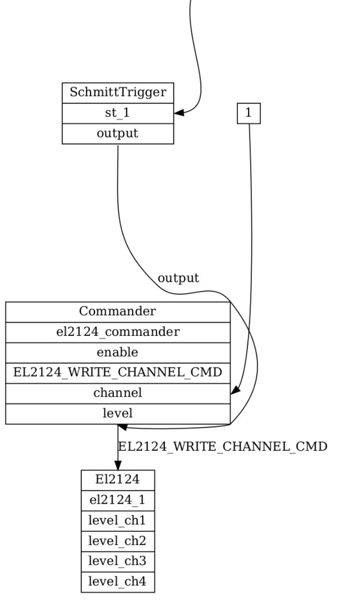
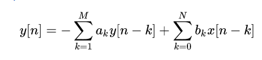

### Fastcat Device List

**JSD and Offline Devices**

For every `JSD Device` there is an `Offline Device` to emulate the behavior of the hardware.

| Name     | Manufacturer | Description                         |
| -------- | ------------ | ----------------------------------- |
| Actuator | Elmo         | EGD with extra features             |
| Egd      | Elmo         | Elmo Gold Drive line of controllers |
| El3208   | Beckhoff     | 8-channel RTD Input                 |
| El3162   | Beckhoff     | 2-channel 0-10v SE Analog Input     |
| El3602   | Beckhoff     | 2-channel +/-10v Diff. Analog Input |
| El2124   | Beckhoff     | 4-channel 5v Digital Output         |
| El4102   | Beckhoff     | 2-channel 0-10v Analog Output       |
| Ild1900  | Micro-Epsilon | Distance Laser Sensor |
| AtiFts   | ATI          | Force-Torque Sensor                 |
| JED0101  | JPL          | JPL EtherCAT Device 0101 - EELS     |
| JED0200  | JPL          | JPL EtherCAT Device 0200 - SAEL     |

**Fastcat Devices**

`Fastcat Devices` do not have any physical EtherCAT hardware equivalent. The operate identically regardless if they consume  `Offline Device` or `JSD Device`  `Signals`

| Name            | Description                                                  |
| --------------- | ------------------------------------------------------------ |
| Commander       | Routes `Signals` to command arguments and issues internal commands to other devices |
| Conditional     | Logical test for signal with a boolean state data field      |
| Faulter         | Emits a fault if a the input signal != 0                     |
| Filter          | Supports Digital AB and Moving Average filtering on Signals  |
| Fts             | Reads in 6 'raw' signals and multiplies them through a 6x6 calibration matrix to compute a wrench |
| Function        | Applies a function to a single input signal (e.g. parametrized N-order polynomial) |
| Pid             | Applies a PID Controller to signal with deadband and persistence arguments |
| Saturation      | Applies upper and lower saturation limits to a signal        |
| SchmittTrigger  | Simple software debounce trigger, parameterized with upper and lower thresholds |
| SignalGenerator | Generates a parameterized signal (e.g. sine wave or sawtooth) useful for testing devices and configurations |
| VirtualFts      | Reads in 6 signals (corresponding to a wrench) and applies the adjoint wrench transformation to different 6DOF pose |
| LinearInterpolation | Passes a signal through a user-specified table using linear interpolation |

---

## YAML Parameters

## Fastcat Global Parameters

| Parameter Name                       | Description                                                  | Type   | Recommended Value |
| ------------------------------------ | ------------------------------------------------------------ | ------ | ----------------- |
| `target_loop_rate_hz`                | Loop Rate of Fastcat Application                             | double | 100 - 500         |
| `zero_latency_required`              | Controls Manager reaction if circular `Signal` dependencies exist | bool   | True              |
| `actuator_position_directory`        | Parent directory of actuator saved position file             | string | /tmp/             |
| `actuator_fault_on_missing_pos_file` | If true, Fastcat will fail during initialization if a saved pos file does not exist | bool   | True              |

#### target_loop_rate_hz

Some devices use of the loop period to provide better performance so the application should try to honor this loop rate. For example, the EGD slave uses the loop period to perform some interpolation between commands. The `fastcat::manager` class has a getter for this loop rate parameter, `double GetTargetLoopRate()` so applications can easily extract this parameter from the library without redundant parameterization or YAML parsing.

#### zero_latency_required

During initialization, devices will be reordered by the manager to ensure that the processing order ensures that `Signal` consumers follow `Signal` producers. If there exists a cyclic dependency (e.g. A observes B and B observes A) this parameter controls how the manager reacts when 'zero latency' cannot be achieved within the fastcat device bus. If True, the manager will fault during configuration. If False, the manager will print out a helpful warning message and ignore the cyclic dependency.

#### actuator_position_directory

To work seamlessly with actuators, the manager may need to cache the last known position of actuators if they are using any non-absolute position sensor (e.g. incremental encoder, Hall-effect sensor) The Manager will look inside the `actuator_position_directory` for a pre-existing `fastcat_saved_positions.yaml` file to restore position from this file. 

#### actuator_fault_on_missing_pos_file

The `fastcat_saved_positions.yaml` may not exist for any number of reasons. If this file does not exist, this parameter controls how the manager reacts. if True, then the manager will fault and not initialize. if False, the assumed startup position for all actuators is `0` and when a new `fastcat_saved_positions.yaml` fill will be created when the manager is shutdown by the application.

#### Examples

``` YAML
# Recommended For Online Hardware
fastcat:
	target_loop_rate_hz:                500   # 100 - 500
	zero_latency_required:              True  # Always
	actuator_position_directory:        /cal/ # or any other global location on your filesystem
	actuator_fault_on_missing_pos_file: True  # Online - True, Offline - False
```

``` yaml
# Recommended For Offline Hardware
fastcat:
	target_loop_rate_hz:                500   # 100 - 500
	zero_latency_required:              True  # Always
	actuator_position_directory:        /tmp/ # Recommended this is different from the Online path
	actuator_fault_on_missing_pos_file: False # Let Fastcat Create this for us!
```

---

## Bus Parameters

Fastcat can support multiple buses of each type

| Parameter Name            | Description                                                  |
| ------------------------- | ------------------------------------------------------------ |
| `bus/type`                | Specifies which devices are on this bus {`offline_bus`, `jsd_bus`, `fastcat_bus`} |
| `bus/ifname`              | The interface name only used by JSD bus to indicate which NIC is used for the EtherCAT Master |
| `bus/enable_autorecovery` | `jsd_bus`only. Enables a feature that may attempt to recover the bus if the working counter changes |

#### bus/type

Only 3 special strings are permitted to define the bus types. All devices within a bus are handled by the same context manager so you cannot specify `JSD Devices` on the same bus as `Fastcat Devices` for example.

Each `jsd_bus` denotes a unique EtherCAT Master.

Multiple buses of any time can be supported.

#### bus/ifname

Functionally only used by the `jsd_bus` to specific which Network Interface Controller (NIC) is being used for that EtherCAT Master instance. 

Tip: use `ip a` or `ifconfig` to check your list of interfaces on Debian/Ubuntu

#### bus/enable_autorecovery

This feature aims to recover the EtherCAT Master if a change in working counter (WKC) is detected. This can occur if a slave is not responding properly, the physical bus topology has been changed, or some intermittent power/communication issue is present. 

This feature is NOT real-time safe so it is not recommended to be used beyond debugging efforts. 

#### Examples

``` yaml
buses:
	- type: offline_bus
	  ifname: offline_1
	  devices:
	    ... # Only offline JSD devices can be specified here
	    
	- type: jsd_bus
	  ifname: eno1
	  enable_autorecovery: False
	  devices:
	    ... # Only online JSD devices can be specified here
	    
	- type: fastcat_bus
	  ifname: fastcat_1
	  devices:
	    ... # Only fastcat devices can be specified here
	    
	... # add more {offline_bus, jsd_bus, fastcat_bus} buses as desired
```

---

# Device Parameters

All devices configurations are contained in a `devices` YAML sequence within a bus. 

Every device has a `device_class` that matches the fastcat API class name. A special device class called `IGNORE` is used on `jsd_bus` to tell the EtherCAT master to ignore certain slaves when initializing slaves and exchanging PDOs. The following snippet shows how to use the `IGNORE` device class to ignore the EK1100 passive EtherCAT Bus Coupler.

``` yaml 
buses:
  - type: jsd_bus
    ... 
    devices:
    - device_class: IGNORE # EK1100 Coupler
    - device_class: ... 
```

Every device has a `name` parameter that must be unique for all devices on the bus. The `name` parameter is important because this is how commands are marshaled from the Manager command queue to each unique device.

These two parameters, `device_class` and `name`, are not explicitly covered in the following device configuration parameter descriptions but must be specified for each and every device. 

## JSD and Offline Device Parameters

## Actuator

Engineering Units (EU) are radians for revolute actuators and meters for linear actuators.

| Parameter                       | Description                                                  |
| ------------------------------- | ------------------------------------------------------------ |
| `actuator_type`                 | Either `revolute` or `linear`. This dictates EU of `radians` or `meters` respectively. |
| `gear_ratio`                    | The gear ratio relating motor speed to actuator output (e.g. input/output) |
| `counts_per_rev`                | The number of sensor counts per motor revolution             |
| `max_speed_eu_per_sec`          | Maximum actuator Output speed this drive may be commanded    |
| `max_accel_eu_per_sec2`         | Max actuator output accel this drive may be commanded        |
| `over_speed_multiplier`         | Multiplicative factor over `max_speed_eu_per_sec` that triggers a fault |
| `vel_tracking_error_eu_per_sec` | Fault if tracking error `fabs(Actual Vel - Cmd Vel)` exceeds this parameter |
| `pos_tracking_error_eu`         | Fault if tracking error `fabs(Actual Pos - Cmd Pos)` exceeds this parameter |
| `peak_current_limit_amps`       | Peak instantaneous current permitted to actuator             |
| `peak_current_time_sec`         | Max apply duration of Peak current before dropping down to Max Continuous current |
| `continuous_current_limit_amps` | Max current permitted to actuator                            |
| `torque_slope_amps_per_sec`     | Rate to apply torque in certain profiled torque command modes |
| `low_pos_cal_limit_eu`          | Lower Position Limit typically corresponding to a hardstop. Used for Calibration Command |
| `low_pos_cmd_limit_eu`          | Lowest allowable command position value                      |
| `high_pos_cal_limit_eu`         | Upper Position Limit typically corresponding to a hardstop. Used for Calibration Command |
| `high_pos_cmd_limit_eu`         | Highest allowable command position value                     |
| `holding_duration_sec`          | Duration to hold position after reset or after a motion command before re-engaging brakes |
| `egd_brake_engage_msec`         | How long it takes to re-engage the brakes                    |
| `egd_brake_disengage_msec`      | How long it takes to disengaged the brakes                   |
| `egd_crc`                       | CRC of the flashed Elmo parameter set                        |
| `egd_drive_max_current_limit`   | The Maximum drive current for the Elmo Gold Drive            |
| `smooth_factor`                 | Affects controller smoothing, defaults to `0`                |
| `winding_resistance`            | OPTIONAL: Winding resistance of motor for optional power calculation |
| `torque_constant`               | OPTIONAL: Torque constant of motor for optional power calculation  |
| `motor_encoder_gear_ratio`      | OPTIONAL: Capture any gear ratio between the motor and the encoder, i.e. an output encoder  |
| `ctrl_gain_scheduling_mode`     | OPTIONAL: Gain scheduling mode for the drive's controller: `DISABLED`, `SPEED`, `POSITION`, and `MANUAL`. When not specified, the mode stored in the drive's non-volatile memory is used. |
| `prof_pos_hold`                 | OPTIONAL: Perform active position control after completion of a position profile command. Useful to mimic brakes on actuators that do not have them. |

### Implementation Notes

* The Actuator device Class is based of the JSD Elmo Gold Drive (Egd) device
* Wherever possible, the responsibility to check faults is delegated down to the EtherCAT Slave (rather than keep that logic at the Application layer) to promote the fastest fault-checking possible
  * Position and Velocity Tracking faults are delegated to the Egd slave
  * Overspeed faults are delegated to the Egd slave
* The Egd must be tuned prior to use within Fastcat. 
  * Some parameters like `max_speed_eu_per_sec` are checked against these internal parameters and cannot be exceeded with flashing the drive. 
  * Modifying any of the GPRM parameters and calling `SV` will change the `egd_crc`
  * The Elmo CRC value is checked to make sure the YAML parameters align with the drive parameters

### Example

``` yaml
    - device_class:                  Actuator
      name:                          tool
      actuator_type:                 revolute # eu = radians
      gear_ratio:                    19
      counts_per_rev:                6
      max_speed_eu_per_sec:          100
      max_accel_eu_per_sec2:         10
      over_speed_multiplier:         3.0
      vel_tracking_error_eu_per_sec: 0.157
      pos_tracking_error_eu:         0.157
      peak_current_limit_amps:       25.46
      peak_current_time_sec:         1.0
      continuous_current_limit_amps: 7.5
      torque_slope_amps_per_sec:     2.0
      low_pos_cal_limit_eu:          -1e15
      low_pos_cmd_limit_eu:          -1e15
      high_pos_cmd_limit_eu:         1e15
      high_pos_cal_limit_eu:         1e15
      holding_duration_sec:          5.0
      egd_brake_engage_msec:         10 
      egd_brake_disengage_msec:      10
      egd_crc:                       -3260
      egd_drive_max_current_limit:   10
      smooth_factor:                 0
```


## Egd (Elmo Gold Drive) TODO


## El3208 (8-channel RTD Input)

| Parameter         | Description                                                  |
| ----------------- | ------------------------------------------------------------ |
| `element`         | type of hardware element connected to each channel           |
| `connection`      | number of wires in each channel's connection {`2WIRE`, `3WIRE`, `4WIRE`, `NOT_CONNECTED`} |
| `wire_resistance` | resistance of wires in Ohms, used to improve the temperature estimate if line resistance is known |
| `low_threshold`   | Fault issued if temperature drops below this threshold (deg C.) |
| `high_threshold`  | Fault issued if temperature exceeds this threshold (deg C.)  |

Allowable `element` values (See the EL3208 Beckhoff Manual `0x80n0:19` Data Object)

* `PT100`
* `NI100`
* `PT1000`
* `PT500`
* `PT200`
* `NI1000`
* `NI1000_TK1500`
* `NI120`
* `OHMS4096` - Outputs resistance instead of temp. Senses up to 4096 Ohms (1/16 Ohm resolution)
* `OHMS1024` - Outputs resistance instead of temp. Senses up to 1024 Ohms (1/64 Ohm resolution)
* `KT100_ET_AL`
* `NOT_CONNECTED`

#### Example

```yaml
- device_class: El3208
  name: el3208_1
  element:         [PT100, NI100, PT100, PT100, PT100, PT100, OHMS1024, NOT_CONNECTED]
  connection:      [2WIRE, 2WIRE, 3WIRE, 2WIRE, 4WIRE, 2WIRE, 2WIRE,    NOT_CONNECTED]
  wire_resistance: [0,     0,     0,     0,     0,     0,     0,        0            ]
  low_threshold:   [-100,  -100,  -100,  -100,  -1,     -100,  -100,     1           ]
  high_threshold:  [100,   100,   100,   100,   1,    100,   100,      -1            ]
```

## El3162 (2-channel 0-10v Single-Ended Analog Input)

**The El3162 device has no configuration parameters**

#### Example

``` yaml
- device_class: El3162
  name: el3162_1
```

## El3602 (2-channel +/-10v Diff. Analog Input)

| Parameter   | Description                 |
| ----------- | --------------------------- |
| `range_ch1` | Voltage Range for Channel 1 |
| `range_ch2` | Voltage Range for Channel 2 |

The permitted range values are:

* `10V` - +/- 10 volts
* `5V` - +/- 5 volts
* `2_5V` - Corresponding to +/- 2.5 volts
* `75MV` - Corresponding to +/- 75 **milliVolts**
* `200MV` - Corresponding to +/- 200 **millivolts**

#### Example

``` yaml
- device_class: El3602
  name: el3602_1
  range_ch1: 10V
  range_ch2: 5V
```

## El2124 (4-channel 5v Digital Output)

**The El2124 device has no configuration parameters**

#### Example

``` yaml
- device_class: El2124
  name: el2124_1
```

## El4102 (2-channel 0-10v Analog Output)

**The El4102 device has no configuration parameters.**

#### Example

``` yaml
- device_class: El4102
  name: el4102_1
```

## El3318 (8-channel Thermocouple module)

| Parameter   | Description                 |
| ----------- | --------------------------- |
| `element`   | type of TC hardware element |

The permitted elements are:

* `TYPE_K`
* `TYPE_J`
* `TYPE_L`
* `TYPE_E`
* `TYPE_T`
* `TYPE_N`
* `TYPE_U`
* `TYPE_B`
* `TYPE_R`
* `TYPE_S`
* `TYPE_C`

#### Example

``` yaml
- device_class: El3318
  name: el3318_tc_location_1
  element: TYPE_K
```

## Ild1900 (Distance Laser Sensor)

| Parameter   | Description                 |
| ----------- | --------------------------- |
| `model` | Model number |
| `measuring_rate` | Number of measurements per second (Hz) |
| `averaging_type` | Type of averaging formula applied to measurements |
| `averaging_number` | Number of consecutive measurements averaged together |
| `exposure_mode` | Exposure mode |
| `peak_selection` | Peak selection strategy |

The allowed model numbers are the following strings:

* `2` - measuring range 2 mm, start measuring range 15 mm
* `10` - measuring range 10 mm, start measuring range 20 mm 
* `25` - measuring range 25 mm, start measuring range 25 mm
* `50` - measuring range 50 mm, start measuring range 40 mm
* `100` - measuring range 100 mm, start measuring range 50 mm
* `200` - measuring range 200 mm, start measuring range 60 mm
* `500` - measuring range 500 mm, start measuring range 100 mm
* `2LL` - measuring range 2 mm, start measuring range 15 mm
* `6LL` - measuring range 6 mm, start measuring range 17 mm
* `10LL` - measuring range 10 mm, start measuring range 20 mm
* `25LL` - measuring range 25 mm, start measuring range 25 mm
* `50LL` - measuring range 50 mm, start measuring range 40 mm

The available averaging types are:

* `NONE` - no averaging
* `MEDIAN` - median from specified number of measurements
* `MOVING` - arithmetic average from specified number of measurements
* `RECURSIVE` - Weighted average of new measured value with previous averaging value.

The available exposure modes are:

* `STANDARD` - exposure time automatically adjusted so that intensity is %50
* `INTELLIGENT` - for moving objects or material transitions
* `BACKGROUND` - improves ambient light tolerance, but halves output rate

The available peak selection strategies are:

* `HIGHEST` - peak with highest intensity
* `WIDEST` - peak with largest surface
* `LAST` - peak furthest away from sensor
* `FIRST` - nearest peak to sensor

### Notes

* The maximum measuring rate is 10000.
* If `averaging_type` is `NONE`, `averaging_number` will be ignored and can be omitted.
* If `averaging_type` is `MEDIAN`, `averaging_number` must be 3, 5, 7, or 9.
* If `averaging_type` is `MOVING`, `averaging_number` must be a power of 2: 2, 4, 8, ..., 4096.
* If `averaging_type` is `RECURSIVE`, `averaging_number` must be in the range \[1, 32000].

### Example

``` yaml
- device_class: Ild1900
  name: ild1900_1
  model: 100
  measuring_rate: 250.0
  averaging_type: MEDIAN
  averaging_number: 9
  exposure_mode: STANDARD
  peak_selection: HIGHEST
```

## AtiFts (Force Torque Sensor)

| Parameter     | Description                                                  |
| ------------- | ------------------------------------------------------------ |
| `calibration` | Integer value corresponding to as-quoted calibration entries |
| `max_force_x` | If the force on x axis exceed this value, emit a fault       |
| `max_force_y` | If the force on y axis exceed this value, emit a fault       |
| `max_force_z` | If the force on z axis exceed this value, emit a fault       |
| `max_torque_x`| If the torque on x axis exceed this value, emit a fault       |
| `max_torque_y`| If the torque on y axis exceed this value, emit a fault       |
| `max_torque_z`| If the torque on z axis exceed this value, emit a fault       |


The `calibration` value by default is `0` if additional calibrations were ordered from ATI, the can be accessed by increasing this index value. It's not possible to look up which calibration integer maps to which calibration, but fastcat will report the calibration name and relevant units.

The `max_force_{x,y,z}` and `max_torque_{x,y,z}` fault checks are evaluated like so:

``` 
if fabs(f{x,y,z}) > max_force_{x,y,z}) then fault
```

#### Example

``` yaml
- device_class: AtiFts
  name:         ati_fts_1
  calibration:  0
  max_force_x:  25
  max_force_y:  25
  max_force_z:  100
  max_torque_x: 2
  max_torque_y: 2
  max_torque_z: 10
```

This `calibration: 0` yields `SI-580-20` with units of Newtons and Newton-Meters. 

``` bash
[SUCCESS](/tmp/fastcat/build/_deps/jsd-src/src/jsd.c:420)   slave[1] ATI EtherCAT F/T Sensor - Configured
[ INFO  ](/tmp/fastcat/build/_deps/jsd-src/src/jsd_ati_fts.c:103) Configuring slave no: 1,  SII inferred name: ATI EtherCAT F/T Sensor
[ INFO  ](/tmp/fastcat/build/_deps/jsd-src/src/jsd_ati_fts.c:105)    Configured name: ati_fts_1
...
[ INFO  ](/tmp/fastcat/build/_deps/jsd-src/src/jsd_ati_fts.c:139)    ATI Firmware version: 1.0.17
...
[ INFO  ](/tmp/fastcat/build/_deps/jsd-src/src/jsd_ati_fts.c:153)    ATI Serial Number: FT33228
[ INFO  ](/tmp/fastcat/build/_deps/jsd-src/src/jsd_ati_fts.c:154)    ATI Calibration Integer (0) maps to: SI-580-20
[ INFO  ](/tmp/fastcat/build/_deps/jsd-src/src/jsd_ati_fts.c:156)    ATI Calibration Family: ECat
[ INFO  ](/tmp/fastcat/build/_deps/jsd-src/src/jsd_ati_fts.c:157)    ATI Calibration Date: 2021-01-15 05:00:00Z
[ INFO  ](/tmp/fastcat/build/_deps/jsd-src/src/jsd_ati_fts.c:158)    ATI force units: N (2)
[ INFO  ](/tmp/fastcat/build/_deps/jsd-src/src/jsd_ati_fts.c:159)    ATI torque units: N-m (3)
[ INFO  ](/tmp/fastcat/build/_deps/jsd-src/src/jsd_ati_fts.c:160)    ATI counts_per_force: 1000000
[ INFO  ](/tmp/fastcat/build/_deps/jsd-src/src/jsd_ati_fts.c:161)    ATI counts_per_torque: 1000000

```

If `calibration: 1` is specified, the results `SI-290-10` 

``` bash
[ INFO  ](/tmp/fastcat/build/_deps/jsd-src/src/jsd_ati_fts.c:154)    ATI Calibration Integer (1) maps to: SI-290-10

```

## JED0101

| Parameter                       | Description                                                  |
| ------------------------------- | ------------------------------------------------------------ |
| `initial_cmd`                   | A float64 that is sent in the initial `cmd` PDO. Unused.     |

#### Example

``` yaml
- device_class: Jed0101
  name: jed0101_1
  initial_cmd: 42
````

## JED0200

| Parameter                       | Description                                                  |
| ------------------------------- | ------------------------------------------------------------ |
| `initial_cmd`                   | A float64 that is sent in the initial `cmd` PDO. Unused.     |

#### Example

``` yaml
- device_class: Jed0200
  name: jed0200_1
  initial_cmd: 42
````

## Fastcat Device Parameters

Recall only `Fastcat Devices` can use `Signals` to acquire state data from other modules.

## Signal Specification

`Signals` are defined in a way such that they can be parse the same regardless of which device use them. The only exception to this rule is for `Commander` devices, which have an additional parameter called `cmd_field_name` This is covered in the `Commander` section below.

There are 2 types of `Signals` that devices may observe: `Device Signals` and `Fixed-value Signals`. 

* `Device Signals` are updated every process loop by the device's `Read()` method 

* `Fixed-value Signals` are specified constant values

Both types have their usefulness within fastcat systems.

If the `observed_device_name` does not exist, the manager will display a warning and fault during initialization. 

If the `request_signal_name` does not match a valid field of the observed device class, the then manager will display a warning and fault during initialization.

#### Examples

A device signal that observes the output of a `SignalGenerator` device named `sig_gen_1`:

``` yaml
signals:
  - observed_device_name: sig_gen_1
    request_signal_name:  output
  # ... more signals here if applicable
```

A fixed-value signal that causes the `Fastcat Device` to always observe a value of `1`: 

``` yaml
signals:
  - observed_device_name: FIXED_VALUE
    fixed_value:          1
  # ... more signals here if applicable
```

## Commander

The commander device observes multiple signals and emit a specified command. The number of signals must match the number of arguments in the command. 

| Parameter         | Description                                                  |
| ----------------- | ------------------------------------------------------------ |
| `start_enabled`   | If true, the commander start issuing the command after initialization. Otherwise, it needs to be enabled first by application command. |
| `skip_n_loops`    | If enabled, the commander will skip this number of process loops before issuing the next command. Set `skip_n_loops: 0` for the commander to issue the command every process loop. |
| `device_cmd_name` | The name of device to which commander sends its command      |
| `device_cmd_type` | Specifies which command to issue in ALL_CAPS e.g. `EL2124_WRITE_CHANNEL_CMD` |

The list of commands is defined in `src/fcgen/fastcat_types.yaml` . The number of signals MUST match the number of arguments in the command, else the manager will fail to initialize. 

The additional `Signal` parameter `cmd_field_name` is used to specific which signal maps to which argument. This parameter was need in order to no rely on signal ordering to index into command arguments. 

#### Example

The following example illustrates a simple bang-bang heater controller using a SchmittTrigger, Commander, and EL2124 (digital output) devices. Say we have a heater circuit attached to the Channel 1 output of the EL2124 device and want to use the `EL2124_WRITE_CHANNEL_CMD` to turn a heater on or off depending on some sensed temperature. 

First, we need to understand the command arguments defined in `src/fcgen/fastcat_types.yaml` shown below:

``` yaml
commands:
  # ... 
  - name: el2124_write_channel
    fields:
    - name: channel
      type: uint8_t
    - name: level
      type: uint8_t
  # ... 
```

In the following YAML snippet, the commander observes a SchmittTrigger boolean signal and passes it along to the `level` argument of the command. The `channel` argument is fixed to `1` by the `FIXED_VALUE` signal.  Notice the use of `cmd_field_name` to ensure that the order of `level` or `channel` signals do not matter. 

``` yaml
- device_class: Commander
  name: el2124_commander 
  start_enabled: False
  skip_n_loops:   0  
  device_cmd_name: el2124_1
  device_cmd_type: EL2124_WRITE_CHANNEL_CMD
  signals:
  - observed_device_name: FIXED_VALUE
    fixed_value:          1
    cmd_field_name:       channel
  - observed_device_name: st_1
    request_signal_name:  output
    cmd_field_name:       level
```

This YAML generates the following fcviz graph:



## Conditional

| Parameter         | Description                                                  |
| ----------------- | ------------------------------------------------------------ |
| conditional_type  | Comparison operator. Valid types: {`<`, `<=`, `>`, `>=`, `==`, `!=`} |
| compare_rhs_value | Value on the "Right-hand Side" of the operator               |

The `Signal` is always on the left-hand side of the logical test, like so:

``` c
bool output = (double)signal_value > (double)compare_rhs_value;
```

Note: The comparison types are double so be careful when using `==` and `!=`

#### Example

This Example checks if the observed signal is greater than `9.5`

``` yaml
- device_class: Conditional
  name: cond_1
  conditional_type: ">"
  compare_rhs_value: 9.5
  signals:
  - observed_device_name: sig_gen_1
    request_signal_name: output
```

## Faulter

| Parameter       | Description                                                  |
| --------------- | ------------------------------------------------------------ |
| `start_enabled` | If True, starts monitoring the input signal immediately after initialization |

The Faulter device observes the input signal and will emit a global fault if the signal value is non-zero.

Tip: Give your Faulter devices a descriptive name that will help you diagnose which fault condition was tripped.

#### Example

``` yaml
- device_class: Faulter
  name: faulter_high_sine_value
  start_enabled: False
  signals:
  - observed_device_name: cond_1
    request_signal_name: output
```

## Filter

| Parameter     | Description                                                  |
| ------------- | ------------------------------------------------------------ |
| `filter_type` | The type of filter {`DIGITAL_AB`, `MOVING_AVERAGE`}          |
| `A`           | `DIGITAL_AB` only. The variable-sized A coefficients array   |
| `B`           | `DIGITAL_AB` only. the variable-sized B coefficients array   |
| `buffer_size` | `MOVING_AVERAGE` only. The number of samples to compute the moving-average over. |

Digital AB filters take the form: 



* `n` is the current sample iteration
* `M` is the length of `A`
* `N` is the length of `B`
* `Y` is the response, saved in the state data of the `filter` device.

#### Example

Digital AB Filter Example:

``` yaml
- device_class: Filter
  name: filt_lowpass_1
  filter_type: DIGITAL_AB
  # 2nd order Butterworth, Wn=0.5 - aggressive
  A: [1.0, 0.0, 0.1715729]
  B: [0.2928932, 0.5857864, 0.2928932]
  signals:
  - observed_device_name: sig_gen_1
    request_signal_name:  output
```

Simple Moving Average Example:

``` yaml
- device_class: Filter
  name: filt_ma_1
  filter_type: MOVING_AVERAGE
  buffer_size : 10
  signals:
  - observed_device_name: sig_gen_1
    request_signal_name:  output
```

## Fts

| Parameter            | Description                                                  |
| -------------------- | ------------------------------------------------------------ |
| `calibration_matrix` | the 6x6 calibration matrix. Converts 6 input signals to wrench. |
| `max_force_x` | If the force on x axis exceed this value, emit a fault       |
| `max_force_y` | If the force on y axis exceed this value, emit a fault       |
| `max_force_z` | If the force on z axis exceed this value, emit a fault       |
| `max_torque_x`| If the torque on x axis exceed this value, emit a fault       |
| `max_torque_y`| If the torque on y axis exceed this value, emit a fault       |
| `max_torque_z`| If the torque on z axis exceed this value, emit a fault       |

````
wrench[6x1] = calibration_matrix[6x6] * signals[6x1]
````

The `max_force_{x,y,z}` and `max_torque_{x,y,z}` fault checks are evaluated like so:

``` 
if fabs(f{x,y,z}) > max_force_{x,y,z}) then fault
```

Note: Exactly 6 signals must be specified in the signals list.

#### Example

``` yaml
- device_class: Fts
  name: fts_1
  calibration_matrix: [1,0,0, 0,0,0,  
                       0,1,0, 0,0,0, 
                       0,0,1, 0,0,0, 
                       0,0,0, 1,0,0,  
                       0,0,0, 0,1,0,  
                       0,0,0, 0,0,1]
  max_force_x: 4900
  max_force_y: 4900
  max_force_z: 4900
  max_torque_x: 10000
  max_torque_y: 10000
  max_torque_z: 10000

  signals:
  - observed_device_name: sig_gen_1
    request_signal_name:  output
  - observed_device_name: FIXED_VALUE
    fixed_value:          0
  - observed_device_name: FIXED_VALUE
    fixed_value:          0
  - observed_device_name: FIXED_VALUE
    fixed_value:          0
  - observed_device_name: FIXED_VALUE
    fixed_value:          0
  - observed_device_name: FIXED_VALUE
    fixed_value:          0
```


## Function

| Parameter             | Description                                                  |
| --------------------- | ------------------------------------------------------------ |
| `function_type`       | type of function {`POLYNOMINAL`, `SUMMATION`, `MULTIPLICATION`, `POWER`, `EXPONENTIAL`, `SIGMOID`}  |
|                       |                                                                               |
| for `POLYNOMIAL`:     |                                                                               |
| `order`               | order of polynomial                                                           |
| `coefficients`        | Polynomial coefficients; length must be equal to `order + 1` . Starts with highest-power term. |
|                       |                                                                               |
| for `SUMMATION`:      | no additional parameters, specify `signals` field only, signals will be added together                        |
|                       |                                                                               |
| for `MULTIPLICATION`: | no additional parameters, specify `signals` field only, signals will be multiplied together |   
|                       |                                                                               |
| for `POWER`:          | raises a single signal to a constant power: `(x^a)`                           |
| `exponent`            | exponent                                                                      |
|                       |                                                                               |
| for `EXPONENTIAL`     | raises a constant to the value of a single signal: `(a^x)`                    |
| `base`                | base (`a`; optional; if not provided, defaults to euler's number `e`)         |
|                       |                                                                               |
| for `SIGMOID`:        | logistic function defined by `1.0 / (1 + e^-x)`                               |


### Polynomial
The `coefficients` (here `coeff`) are specified in the following order (`N`)

```
y = coeff[0] * x^(N) + coeff[1] * x^(N-1) + ... + coeff[N-1] * x^(1) + coeff[N] * x^(0);
```

Note: The function device only accepts a single signal. Multi-variate polynomial functions are not currently supported.

#### Example

Implement the function `y = 1*x + 100`

``` yaml
- device_class: Function
  name: fun_1
  function_type: POLYNOMIAL
  order: 1
  coefficients: [1, 100]
  signals:
  - observed_device_name: sig_gen_1
    request_signal_name: output
```


### Summation
Specify two or more signals to sum together

#### Example

Implement the function `y = x1 + x2`

```yaml
- device_class: Function
  name: fun_2
  function_type: SUMMATION
  signals:
  - observed_device_name: sig_gen_1
    request_signal_name: output
  - observed_device_name: sig_gen_2
    request_signal_name: output
```

### Multiplication
Specify two or more signals to multiply together

#### Example

Implement the function `y = x1 * x2 * x3`

```yaml
- device_class: Function
  name: fun_3
  function_type: MULTIPLICATION 
  signals:
  - observed_device_name: sig_gen_1
    request_signal_name: output
  - observed_device_name: sig_gen_2
    request_signal_name: output
  - observed_device_name: sig_gen_3
    request_signal_name: output
```


### Exponential
Raise a constant to the power of the signal

#### Example
Implement the function `y = e^x`

```yaml
- device_class: Function
  name: fun_4
  function_type: EXPONENTIAL
  - observed_device_name: sig_gen_1
    request_signal_name: output
```

Implement the function `y = 2.0^x`
```yaml
- device_class: Function
  name: fun_5
  function_type: EXPONENTIAL
  base: 2.0
  - observed_device_name: sig_gen_1
    request_signal_name: output
```


### Sigmoid
Return the sigmoid logistic function

#### Example
Implement the sigmoid logistic function `y = 1.0 / (1.0 + e^-x)`

```yaml
- device_class: Function
  name: fun_6
  function_type: SIGMOID
  - observed_device_name: sig_gen_1
    request_signal_name: output
```


## Pid

| Parameter      | Description                                                  |
| -------------- | ------------------------------------------------------------ |
| `kp`           | Proportional Gain                                            |
| `ki`           | Integral Gain                                                |
| `kd`           | Derivative Gain                                              |
| `windup_limit` | The max contribution of the integral term (e.g. `ki * error`) |

A basic PID controller. The feedback comes from the observed signal and the controller response is recorded as a Pid device state variable. In order to apply a PID control loop within fastcat, a Commander device must observe the Pid response state variable and route it to the proper command argument. 

#### Example

``` yaml
- device_class: Pid
  name: pid_1
  kp: 0.05
  ki: 0
  kd: 0.01
  windup_limit: 0
  signals:
  - observed_device_name: sig_gen_1
    request_signal_name:  output
```

## Saturation

| Parameter     | Description                                        |
| ------------- | -------------------------------------------------- |
| `lower_limit` | The lower value that the signal will be clipped at |
| `upper_limit` | The upper value the signal will be clipped at      |

Saturates an input signal

#### Example

``` yaml
- device_class: Saturation
  name: sat_1
  lower_limit: -0.05
  upper_limit: 0.05
  signals:
  - observed_device_name: pid_1
    request_signal_name:  output
```

## SchmittTrigger

| Parameter        | Description                |
| ---------------- | -------------------------- |
| `low_threshold`  | The low threshold setting  |
| `high_threshold` | The high threshold setting |

A Schmitt Trigger is a simple debounce software trigger. The following is pseudo code for implementing it:

``` 
if signal is rising
	if signal > high_threshold -> Disable Trigger, set falling
if signal is falling
	if signal < low_threshold -> Enable trigger, set rising
```

#### Example

``` yaml
- device_class: SchmittTrigger
  name: st_1
  low_threshold: 1000
  high_threshold: 4000
  signals:
  - observed_device_name: sig_gen_1
    request_signal_name: output
```


## SignalGenerator

| Parameter               | Description                                               |
| ----------------------- | --------------------------------------------------------- |
| `signal_generator_type` | The type of signal to generate {`SINE_WAVE`, `SAW_TOOTH`, `GAUSSIAN_RANDOM`, `UNIFORM_RANDOM`} |
|                         |                                                           |
| for `SINE_WAVE`:        |                                                           |
| `angular_frequency`     | sine wave angular frequency                               |
| `phase`                 | sine wave phase                                           |
| `amplitude`             | sine wave amplitude                                       |
| `offset`                | sine wave offset                                          |
|                         |                                                           |
| for `SAW_TOOTH`:        |                                                           |
| `max`                   | max value of the sawtooth wave                            |
| `min`                   | min value of the sawtooth wave                            |
| `slope`                 | The rate of change in EU/sec. May be positive or negative |
|                         |                                                           |
| for `GAUSSIAN_RANDOM`:  |                                                           |
| `mean`                  | mean signal value                                         |
| `sigma`                 | standard deviation                                        |
| `seed`                  | specify random seed as an optional unsigned integer; each signal generator uses its own random seed; if no random seed is provided, defaults to 1 |
|                         |                                                           |
| for `UNIFORM_RANDOM`:   |                                                           |
| `max`                   | maximum signal value                                      | 
| `min`                   | minimum signal value                                      |
| `seed`                  | specify random seed as an optional unsigned integer; each signal generator uses its own random seed; if no random seed is provided, defaults to 1 |

The `SINE_WAVE` signal generator output is computed as:

```
output = amplitude * sin(angular_frequency * t + phase) + offset
```

The `SAW_TOOTH` signal generator output is computed as:

* Start at 'lower' limit (`min` if slope > 0, `max` if slope < 0)
* Loop
  * apply slope each process update
  * when the 'upper' limit is reached, reset the output 'lower' limit

#### Examples

``` yaml
- device_class: SignalGenerator
  name: sig_gen_1
  signal_generator_type: SINE_WAVE
  angular_frequency: 0.3141593Repeat 
  phase: 0
  amplitude: 10
  offset: 0
```

``` yaml
- device_class: SignalGenerator
  name: sig_gen_2
  signal_generator_type: SAW_TOOTH
  max: 1
  min: 0
  slope: 1
```

```yaml
- device_class: SignalGenerator
  name: sig_gen_3
  signal_generator_type: GAUSSIAN_RANDOM
  mean: 0.0
  sigma: 0.2
  seed: 50
```

```yaml
- device_class: SignalGenerator
  name: sig_gen_4
  signal_generator_type: UNIFORM_RANDOM
  min: -5.0
  max: 10.0
  # seed is optional
```


## VirtualFts

| Parameter    | Description                                                  |
| ------------ | ------------------------------------------------------------ |
| `position`   | The translation component of transformation                  |
| `quaternion` | the rotation component of transformation as {u, x, y, z} , Option 1 |
| `euler`      | the rotation component of transformat as Euler angles {roll, pitch, yaw}, Option 2 |
| `max_force_x` | If the force on x axis exceed this value, emit a fault       |
| `max_force_y` | If the force on y axis exceed this value, emit a fault       |
| `max_force_z` | If the force on z axis exceed this value, emit a fault       |
| `max_torque_x`| If the torque on x axis exceed this value, emit a fault       |
| `max_torque_y`| If the torque on y axis exceed this value, emit a fault       |
| `max_torque_z`| If the torque on z axis exceed this value, emit a fault       |

The VirtualFts transforms a wrench as if it were sensed at the pose of the specified coordinate frame using the adjoint wrench transformation.

The `max_force_{x,y,z}` and `max_torque_{x,y,z}` parameters are the same as the `Fts` device

Only one of `quaternion` or `euler` parameters need to be specified

Note: The Euler angles are specified in [Roll, Pitch, Yaw] order but are actually computed in Z-Y-X order

#### Example

``` yaml
- device_class: VirtualFts
  name: virtual_fts_1
  position: [1, 0, 1]
  quaternion: [0.7071, 0.35355, 0, 0.35355]
  max_force_x: 4900
  max_force_y: 4900
  max_force_z: 4900
  max_torque_x: 10000
  max_torque_y: 10000
  max_torque_z: 10000
  signals:
  - observed_device_name: fts_1
    request_signal_name: raw_fx
  - observed_device_name: fts_1
    request_signal_name: raw_fy
  - observed_device_name: fts_1
    request_signal_name: raw_fz
  - observed_device_name: fts_1
    request_signal_name: raw_tx
  - observed_device_name: fts_1
    request_signal_name: raw_ty
  - observed_device_name: fts_1
    request_signal_name: raw_tz
```


## LinearInterpolation

| Parameter   | Description |
| ----------- | ----------- |
| domain      | Variable-length array of domain values |
| range       | Variable-length array of range values |
| enable_output_bounds_fault | controls fault behavior |

The LinearInterpolation provides a general method for converting a signal by interpolation table. Within the domain, the output is linearly interpolated between adjacent pivot points where the input is between the pivot points (e.g. domain[i] < intput < domain[i+1])
```
  output = range[i] + (range[i+1] - range[i]) / (domain[i+1] - domain[i]) * (input - domain[i])
```
If the input falls outside the valid domain specified by the input YAML, the output signal saturates and does not attempt extrapolation. the state feedback value `is_saturated` is also set to indicate this has happened. 

If `enable_output_bounds_fault` is `true` then a Fastcat fault is emitted when the device saturates. Otherwise, no faults are emitted by a LinearInterpolation device and it will silently saturate.

### Example

This example implements an absolute value function over the range of [-9, 9] 

``` yaml
- device_class: LinearInterpolation
  name:         my_lin_interp_1 
  domain:       [-9, 0, 9]
  range:        [ 9, 0, 9]
  enable_out_of_bounds_fault: false
  signals:
  - observed_device_name: sig_gen_1
    request_signal_name:  output
```


## ThreeNodeThermalModel

| Parameter   | Description |
| ----------- | ----------- |
| thermal_mass_node_1      | The thermal mass that represents the winding node -- node 1 (J * kg / deg C) |
| thermal_mass_node_2      | The thermal mass that represents the stator node  -- node 2 (J * kg / deg C) |
| thermal_res_nodes_1_to_2      | The effective thermal resistance between nodes 1 and 2 (deg C/W) |
| thermal_res_nodes_2_to_3      | The effective thermal resistance between nodes 2 and 3 (deg C/W) |
| winding_res      | The electrical resistance of the motor windings at the specified reference temperature  (ohms) |
| winding_thermal_cor      | The thermal coefficient of resistance (% / deg C) |
| k1      | Weight for for node 1 used for the weighted-average temperature estimate of node (unitless) |
| k2      | Weight for for node 2 used for the weighted-average temperature estimate of node (unitless) |
| k3      | Weight for for node 3 used for the weighted-average temperature estimate of node (unitless) |
| persistence_limit      | The number of allowable cycles to occur at or above the a temperature threshold before faulting (counts) |
| ref_temp      | The reference temperature of the calibrated resistance parameter above, and to calculate the motor resistance (deg C) |
| max_allowable_temps      | An array of allow able temperatures at each node, in order (deg C) |

The ThreeNodeThermalModel provides a simplified predictive thermal model used to estimate 
temperature change over time in specific locations in a motor. This is primarily useful for
estimating when a motor's internal temperature is at risk of exceeding a threshold that could
damage it's operation. The maximum allowable temperature at each node is prescribable in the 
`max_allowable_temps` parameter supplied to this device.

If the temperature at any one node exceeds the specified max temperature for more the number
of cycles specified by `persistence_limit`, then a Fastcat fault is emitted.

The following equations are utilized within the thermal model:
1. Initialize System:
   * Node 1 and 2 temperatures initialized with Node 3 temperature

1. Every iteration
   * $R_{winding}=R_{ref}*(1 + C_{temp} * (T_1 - Temp_{ref}))$
   * $Q_{in}=I^2*R_{winding}$
   * $T_1+=(Q_{in} - Q_{1T2}) * (dt / CM_1)$
   * $T_2+=(Q_{1T2} - Q_{2T3}) * (dt / CM_2)$
   * $T_4=(k_1 * T_1 + k_2 * T_2 + k_3 * T_3) / (k_1 + k_2 + k_3)$

Where $C_{temp}$ represents the thermal coefficient of resistance, and $CM_{n}$ represents the thermal mass for node $n$

### Example

``` yaml
- device_class: ThreeNodeThermalModel
  name:         three_node_thermal_model_1 
  thermal_mass_node_1: 1.0
  thermal_mass_node_2: 2.0
  thermal_res_nodes_1_to_2: 3.0
  thermal_res_nodes_2_to_3: 4.0
  winding_res: 5.0
  winding_thermal_cor: 6.0
  k1: 1.0
  k2: 1.0
  k3: 2.0
  persistence_limit: 5
  ref_temp: 20
  max_allowable_temps: [65.0, 70.0, 75.0, 80.0]
  signals:
  - observed_device_name: node_3_temp
    request_signal_name:  output
  - observed_device_name: egd_1
    request_signal_name:  actual_current
```