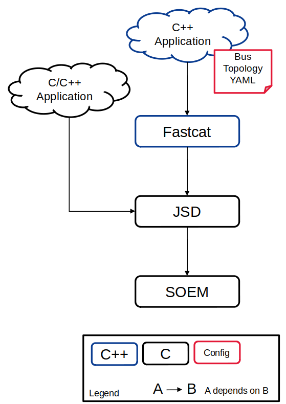
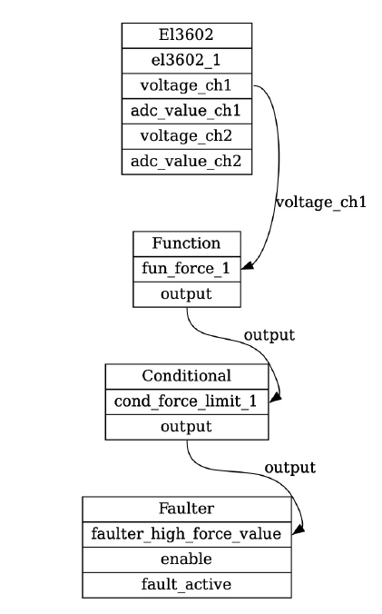
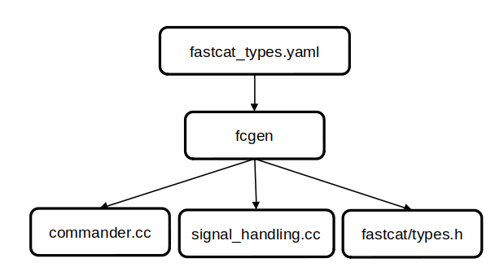

# fastcat Primer

This primer aims to provide a overview of the fastcat library to help users and developers understand key features and concepts. 

## Library Interactions

Instead of implementing in one large library, we chose to break our system into 2 distinct libraries to help maximize flexibility. Those 2 libraries are [Just SOEM Driver](https://github.com/nasa-jpl/jsd) (JSD) and fastcat. !

#### JSD 

JSD is built on [Simple Open EtherCAT Master](https://github.com/OpenEtherCATsociety/SOEM) (SOEM) which implements the complicated EtherCAT Master control system. SOEM does not contain any specific drivers, so that the role JSD fills. JSD is an extremely minimal C driver library with support for ever-growing list of EtherCAT slaves, which makes it a great solution for embedded or highly-streamlined C applications. 

### fastcat

More advanced command and control features are sought to help make EtherCAT topologies more flexible and easier to work with. the Fastcat C++ library adds a number of rich features but admittedly does introduce complexity and more computation overhead compared to JSD.

By composing the system in this way, application to choose the right trade off between JSD and Fastcat. 




## fastcat::manager

The `fastcat::manager` class is the primary context that applications will use to interact with the EtherCAT devices. The manager takes on the roles of:

* Parsing global YAML parameters and delegating device parameter parsing to device classes
* Memory management and structure of devices
* Manages central Command queue (that all application commands must go through)!
* Provide device states to the application

The public API is contained in the `src/manager.h` class definition

## fastcat::device_base

Each device class must inherit from the `fastcat::device_base` class. This ensures that the manager can interact with each and every device in the same manner. The most important methods are shown in the following table (the API documentation should be consulted for the most up-to-date definitions)

| Method           | Description                                                  |
| ---------------- | ------------------------------------------------------------ |
| ConfigFromYaml() | YAML parsing and device initialization                       |
| Read()           | Parse data from the EtherCAT Frame or Fastcat Signal to update device state data |
| Write()          | Handle any new fastcat commands                              |
| Process()        | Write data to the EtherCAT frame (if applicable)             |
| Fault()          | Triggers device fault handling and latches, should result in safe device state |
| Reset()          | Reset device to nominal operating state, required to undo a latched fault |

## fastcat Signals

In order to offer closed-loop control and internal monitoring, fastcat need a way to share state data between devices - fastcat `Signals` are that mechanism. 

Any state variable defined in the `fcgen/fastcat_types.yaml` can be used as a `Signal` source. Signal sources can have multiple consumers. 

Typically, the signal producers are `JSD Devices` and downstream consumers are `Fastcat Devices`. Two special `Fastcat Devices`,  Commander and Faulter devices, commonly serve as signal sinks. 

## Device Types {JSD, Offline, fastcat}

There are 3 types of devices within fastcat:

* `JSD Devices` - map to the library JSD driver
* `Offline Devices` - an offline version of JSD devices that often perform rough 'simulation' of hardware 
* `Fastcat Devices` -  Software constructs that consume Signals. They may emit commands or faults, depending on type. 

All devices produce state data. 

All devices implement basic `Reset()` and `Fault()` handlers

`Signals` can only be used by `Fastcat Devices` and are not used by `JSD Devices` or `Offline Devices`.

The full list of implemented device types is contained in [fastcat_device_config_parameters.md](fastcat_device_config_parameters.md)

## fcviz

The `fcviz` utility is a Python program that creates Graphiz DOT diagrams of an input bus topology YAML configuration. 

Boxes represent Devices

* The 1st entry denotes the Device Type
* The 2nd entry denotes the Device Name
* Following entries denote state variables 

Arrows represent `Signals` 

The following diagram shows the `fcviz` output for a simple bus configuration. 




This example can be recreated with the following command:

``` bash
!$ cd </path/to/fastcat>
$ python3 fcviz/fcviz.py example_configs/paper_examples/paper_faulter_config.yaml
```


## fcgen

The `fcgen` utility is a build target that is invoked at compilation. Most users of fastcat do not need to understand the role of `fcgen` but this is included here for developers.

There is one input file located at `src/fcgen/fastcat_types.yaml` that is read and parsed by `fcgen` that describes all states and all commands used by the various device types within fastcat. From this central definition, the Python utility `cogapp`  autocoder is invoked to created 3 implementation files, they are:

* `fastcat/types.h` - Struct definitions for all device states and device commands
* `commander.cc` - Handling for each command type in order to route `Signals` into command arguments
* `signal_handling.cc` - book-keeps state data types and promotes them to `double` during the device `Read()` function to implement fastcat `Signals`

